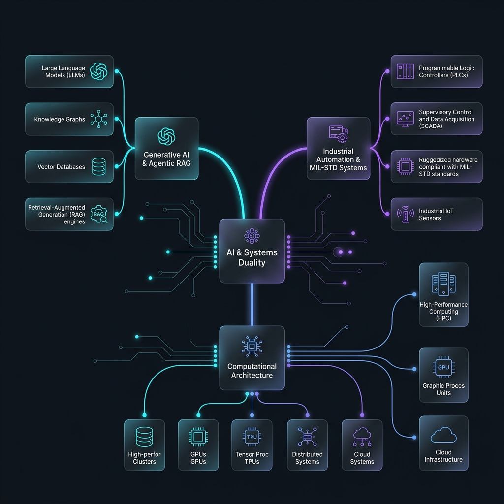

<div align="center">


<br/>


<br/>

*Architecting next-generation intelligent platforms where military-grade reliability meets advanced Generative AI.*

<br/>

[](https://swetang-portfolio.vercel.app)
[](https://www.linkedin.com/in/gajjarswetang/)
[](mailto:gajjarswetang@gmail.com)
[](https://github.com/SGajjar24)

<br/>


</div>


## :rocket: About Me

```python
class SwetangGajjar(SeniorAIArchitect, SystemsEngineer):
    """
    Bridging military-grade system reliability with advanced Generative AI architectures.
    Over 12 years of hands-on expertise across critical defense systems, industrial automation,
    grounded LLM design (RAG), and bilingual natural language processing.
    """
    def __init__(self):
        self.name = "Swetang Gajjar"
        self.role = "Lead Architect & Senior Systems Consultant"
        self.location = "India | USA | Open to Remote"
        self.education = "M.S. Computer Engineering | California State University, Fullerton"
        
        self.core_domains = {
            "Generative_AI": [
                "Advanced RAG Architectures (Zero-Hallucination)",
                "Agentic Workflows & Multi-Agent Orchestration",
                "Long-Context Reasoning & Vector Databases"
            ],
            "Systems_&_Automation": [
                "Industrial Automation & Machine Vision",
                "MIL-STD-130N Compliance & Barcode/OCR Systems",
                "Bilingual OCR Pipelines (Gujarati-English) + Neural Post-Correction"
            ],
            "Strategic_Leadership": [
                "Engineering Management (Teams of 5+)",
                "End-to-End Project Lifecycle Delivery (15+ key initiatives)",
                "Cloud Cost Optimization (40% operational reduction)"
            ]
        }
        
        self.fun_fact = "Fusing the ancient principles of Vastu Shastra with state-of-the-art agentic AI frameworks!"
```

<div align="center">
  <br/>
  
  <br/>
  <sub><i>Interactive Systems Infographic: The Duality of Physical Architecture, GenAI RAG Pipelines, and Industrial Control Systems.</i></sub>
</div>


## :bar_chart: Enterprise Technical Performance & Metrics

<div align="center">
<table width="95%">
  <tr>
    <th width="35%" align="left">System Engineering Metric</th>
    <th width="45%" align="left">Quantitative Operational Impact</th>
    <th width="20%" align="center">Validation Badge</th>
  </tr>
  <tr>
    <td><b>🚀 Grounded GenAI & RAG</b><br/><sub>Forensic Retrieval & Legal Reasoning</sub></td>
    <td><code>████████████████████████████████░░░</code> <b>95%+ Retrieval Accuracy</b></td>
    <td align="center"></td>
  </tr>
  <tr>
    <td><b>⚡ LLM Fine-Tuning & Quantization</b><br/><sub>Inference Optimization & Latency Control</sub></td>
    <td><code>██████████████████████████████░░░░░</code> <b>-30% Compute Latency</b></td>
    <td align="center"></td>
  </tr>
  <tr>
    <td><b>☁️ Cloud Cost Engineering</b><br/><sub>Serverless Architecture & Infrastructure Design</sub></td>
    <td><code>████████████████████████████░░░░░░░</code> <b>40% Infrastructure Savings</b></td>
    <td align="center"></td>
  </tr>
  <tr>
    <td><b>👁️ Machine Vision & OCR Precision</b><br/><sub>Bilingual Neural OCR & MIL-STD Marking</sub></td>
    <td><code>█████████████████████████████████░░</code> <b>99.9% QA Precision Rate</b></td>
    <td align="center"></td>
  </tr>
</table>
</div>


## :star2: Elite Engineering Milestones

<div align="center">
<table width="95%">
  <tr>
    <th width="35%" align="left">Core Competency Domain</th>
    <th width="45%" align="left">Expertise Level & Progress</th>
    <th width="20%" align="center">Rating Badge</th>
  </tr>
  <tr>
    <td><b>🤖 GenAI & Agentic RAG Systems</b><br/><sub>LangGraph, LangChain, Hybrid Retrieval, Grounded Citations</sub></td>
    <td><code>██████████████████████████████████░</code> <b>97%</b></td>
    <td align="center"></td>
  </tr>
  <tr>
    <td><b>🛡️ Military & Defense Engineering</b><br/><sub>ITAR Compliance, MIL-STD-130N, AS9100D, Real-Time C++</sub></td>
    <td><code>█████████████████████████████████░░</code> <b>95%</b></td>
    <td align="center"></td>
  </tr>
  <tr>
    <td><b>🔤 Bilingual OCR & NLP Pipelines</b><br/><sub>Neural Gujarati-English OCR, OpenCV, AI Post-Correction</sub></td>
    <td><code>█████████████████████████████████░░</code> <b>94%</b></td>
    <td align="center"></td>
  </tr>
  <tr>
    <td><b>💎 Cloud Architecture & Cost Optimization</b><br/><sub>AWS/Azure Infrastructure, Cloud Cost Modeling, Re-architecting</sub></td>
    <td><code>███████████████████████████████░░░░</code> <b>90%</b></td>
    <td align="center"></td>
  </tr>
  <tr>
    <td><b>👑 Product Leadership & Execution</b><br/><sub>Managing Teams of 5+, Overseeing 15+ Core Enterprise Releases</sub></td>
    <td><code>████████████████████████████████░░░</code> <b>92%</b></td>
    <td align="center"></td>
  </tr>
  <tr>
    <td><b>💻 Language Proficiencies</b><br/><sub>Python, TypeScript/React 19, C++, C#, SQL & Vector DBs</sub></td>
    <td><code>██████████████████████████████████░</code> <b>96%</b></td>
    <td align="center"></td>
  </tr>
</table>
</div>


## :briefcase: Professional Timeline & Experience

| Period | Role | Focus & Key Achievements |
|:---|:---|:---|
| **2024 - Present** | **Senior AI/ML Architect & Consultant** | Independent. Architected grounded RAG legal document pipelines (95%+ anomaly detection accuracy) and high-throughput bilingual Gujarati-English OCR pipelines with neural correction. |
| **2024 - 2025** | **AI Engineer (Contract @ Scale AI)** | Engineered high-quality LLM alignment benchmarks and training datasets. Optimized AI coding algorithms, achieving a **30% reduction in inference latency**. |
| **2022 - Present** | **Independent Software Consultant** | Led end-to-end project lifecycles for 15+ client engagements across defense and tech. Achieved a **40% operational cloud cost reduction**. |
| **2017 - 2022** | **Senior Software Engineer (Jetec Corp)** | Led a team of 5 engineers developing next-gen industrial automation systems. Built **MIL-STD-130N & ITAR compliant** OCR barcode marking software for key defense programs. |
| **2016 - 2017** | **Associate Software Engineer (Jetec Corp)** | Modernized motion controlling software enabling precise 4-axis control and improving industrial marking system reliability by **35%**. |

> *Full professional chronology, portfolio media, and client details are available on my [LinkedIn Profile](https://www.linkedin.com/in/gajjarswetang/).*


## :star: Flagship AI Project Spotlight

### :brain: [Agentic System for Automated Document Forensic Analysis (2024 - Present)](https://github.com/SGajjar24)
**Enterprise-Grade Forensic RAG Engine for Regulated Domains**

A sophisticated, multi-agent RAG system designed for deep forensic analysis of complex document lineages (revenue records, land deeds, and court filings). The system provides fully traceable, non-hallucinatory reasoning to identify structural inconsistencies, timeline anomalies, and ownership lineage alterations over multi-decade spans.

*   **Zero-Hallucination Grounding**: Custom retrieval flow that forces LLMs to produce verifiable, court-admissible citations.
*   **Temporal Entity Resolution**: Recovers identity and ownership changes across decades of highly fragmented OCR records.
*   **Hybrid Multilingual Processing**: Full OCR pipeline support for bilingual Gujarati-English texts with transformer-based post-correction.
*   **Tech Stack**: `Gemini 2.5 Flash/Pro` | `NotebookLM` | `Python` | `Vector Databases (FAISS)` | `Langflow` | `LangChain` | `MCP/Antigravity`


## :hammer_and_wrench: Complete Technical Stack & Systems Matrix

<div align="center">

<picture>
  <source media="(prefers-color-scheme: dark)" srcset="https://skillicons.dev/icons?i=python,ts,react,nextjs,tailwind,vite,nodejs,fastapi,firebase,aws,azure,docker,cpp,cs,tensorflow,opencv,git,github,vscode,figma&perline=10&theme=dark&v=1.3" />
  <source media="(prefers-color-scheme: light)" srcset="https://skillicons.dev/icons?i=python,ts,react,nextjs,tailwind,vite,nodejs,fastapi,firebase,aws,azure,docker,cpp,cs,tensorflow,opencv,git,github,vscode,figma&perline=10&theme=light&v=1.3" />
  
</picture>

</div>

<br/>

An exhaustive, domain-by-domain mapping of my software development engineering capabilities, standard protocols, and system architecture frameworks:

<table width="100%">
  <tr>
    <td width="50%" valign="top">
      <h3>🤖 Generative AI & Agentic Core</h3>
      <ul>
        <li><b>Orchestration & Frameworks:</b> <code>LangChain</code> | <code>LangGraph</code> | <code>Langflow</code> | <code>LlamaIndex</code> | <code>CrewAI</code></li>
        <li><b>Agentic Design Patterns:</b> <code>Self-Correcting RAG Loops</code> | <code>DSPy (Programming Foundation Models)</code> | <code>Multi-Agent Task Routing</code></li>
        <li><b>Large Language Models:</b> <code>Gemini 2.5 Pro & Flash</code> | <code>DeepSeek R1/V3 (Reasoning Models)</code> | <code>Claude 3.5 Sonnet</code> | <code>GPT-4o</code></li>
        <li><b>RAG & Vector Engineering:</b> <code>Hybrid Lexical-Semantic Search</code> | <code>FAISS</code> | <code>ChromaDB</code> | <code>Pinecone</code> | <code>PGVector</code></li>
        <li><b>Retrieval & Guardrails:</b> <code>Zero-Hallucination Grounding</code> | <code>Parent-Document Retrieval</code> | <code>Reciprocal Rank Fusion (RRF)</code> | <code>Cohere ReRank</code> | <code>BGE-Reranker</code></li>
        <li><b>Context & Safety:</b> <code>Semantic & Recursive Chunking</code> | <code>Source-Citing Verification Pipelines</code> | <code>Llama Guard</code></li>
      </ul>
      <br/>
      
    </td>
    <td width="50%" valign="top">
      <h3>👁️ Machine Vision & OCR Engineering</h3>
      <ul>
        <li><b>Pre-processing & Enhancement:</b> <code>Otsu's Adaptive Binarization</code> | <code>Morphological Operations (Dilation/Erosion)</code> | <code>Gaussian & Bilateral Filtering</code></li>
        <li><b>Perspective & Geometry:</b> <code>Homography Matrices</code> | <code>OpenCV warpPerspective</code> | <code>Contour Detection & Poly-Approximation</code></li>
        <li><b>Multilingual Neural OCR:</b> <code>Bilingual (Gujarati-English) Scripts</code> | <code>Compound Character / Ligature Segmentations</code></li>
        <li><b>Sequence & Language Models:</b> <code>CRNN (CNN + BiLSTM) Sequence Learning</code> | <code>Seq2Seq NLP Neural Post-Correction</code> | <code>Levenshtein Spelling Heuristics</code></li>
        <li><b>Frameworks & Engines:</b> <code>Tesseract OCR (Custom C++ Compilations)</code> | <code>EasyOCR (CRAFT Detection)</code> | <code>PaddleOCR</code> | <code>OpenCV (C++/Python)</code></li>
      </ul>
      <br/>
      
    </td>
  </tr>
  <tr>
    <td width="50%" valign="top">
      <h3>🛡️ Defense & Systems Engineering</h3>
      <ul>
        <li><b>Standards & Certifications:</b> <code>MIL-STD-130N Standard (UID compliance)</code> | <code>AS9100D Aerospace QC</code> | <code>ISO 9001:2015</code></li>
        <li><b>Marking Technologies:</b> <code>UID Laser Marking</code> | <code>Dot Peen & High-Speed Inkjet Serialization</code></li>
        <li><b>Compliance & Access:</b> <code>ITAR Compliance (International Traffic in Arms)</code> | <code>Air-Gapped Offline Architectures</code> | <code>Secure Audit Trails</code></li>
        <li><b>Automation Hardware:</b> <code>4-Axis Motion Controllers (Galil, Trio)</code> | <code>Servo & Stepper Motors (PID Loop Tuning)</code> | <code>PLC Modbus TCP/IP</code></li>
        <li><b>Systems Programming:</b> <code>Real-Time C++ Control Systems</code> | <code>C# .NET Core Windows Services</code> | <code>Multi-threaded Data Acquisition (DAQ)</code></li>
      </ul>
      <br/>
      
    </td>
    <td width="50%" valign="top">
      <h3>💻 Core Development & Languages</h3>
      <ul>
        <li><b>Primary Coding:</b> <code>Python 3.12+ (Type Hinting, Asyncio)</code> | <code>C++ 17/20 (STL, Smart Pointers, Memory Management)</code> | <code>C# .NET 8 (TPL, Async/Await)</code> | <code>TypeScript 5+</code></li>
        <li><b>Backends & Interfaces:</b> <code>FastAPI (Pydantic v2, Dependency Injection)</code> | <code>Node.js (Express, Asynchronous Event Loops)</code> | <code>Prisma ORM</code></li>
        <li><b>Serialization Formats:</b> <code>JSON-LD Structured Schemas</code> | <code>YAML Configs</code> | <code>Protocol Buffers (Protobuf)</code> | <code>XML</code></li>
        <li><b>Data Storage & Latency:</b> <code>PostgreSQL (Indexing & Query Optimization)</code> | <code>SQLite (Embedded Application Cache)</code> | <code>Firebase Firestore</code></li>
      </ul>
      <br/>
      
    </td>
  </tr>
  <tr>
    <td width="50%" valign="top">
      <h3>🎨 Frontend Architectures & Design</h3>
      <ul>
        <li><b>Core Frameworks:</b> <code>React 19 (Server Components, Actions API, Suspense)</code> | <code>Next.js 15 (App Router, SSR, SSG, ISR)</code> | <code>Vite 6</code></li>
        <li><b>Creative UI & Layouts:</b> <code>Tailwind CSS v4.0 (CSS-first config, native CSS variables)</code> | <code>Framer Motion</code> | <code>Glassmorphism UI</code></li>
        <li><b>Telemetry Visuals:</b> <code>HTML5 Canvas API (Interactive Topologies)</code> | <code>Recharts (Real-time telemetry graphing)</code></li>
        <li><b>SEO & Optimization:</b> <code>JSON-LD Schema Optimization</code> | <code>Semantic HTML5 structure</code> | <code>Lighthouse 90+ Score Compliance</code></li>
      </ul>
      <br/>
      
    </td>
    <td width="50%" valign="top">
      <h3>☁️ Clouds, DevOps & Deployments</h3>
      <ul>
        <li><b>Cloud & Edge Architectures:</b> <code>AWS IoT Core & Greengrass Lambda</code> | <code>AWS EC2/S3/IAM Roles</code> | <code>Azure AI Fundamentals & Cognitive Services</code></li>
        <li><b>Infrastructure & Containers:</b> <code>Docker (Multi-stage Alpine image build optimizations)</code> | <code>Docker Compose</code></li>
        <li><b>CI/CD Pipelines:</b> <code>GitHub Actions (YAML workflows, automated builds, secret masking)</code> | <code>PyPI Package Publishing (pyproject.toml)</code></li>
        <li><b>Hosting Platforms:</b> <code>Vercel (Serverless Edge Middleware)</code> | <code>Netlify</code> | <code>Firebase Hosting (Multi-target setups)</code></li>
      </ul>
      <br/>
      
    </td>
  </tr>
</table>


## :file_folder: Curated Project Showcases

<table width="100%">
  <tr>
    <td width="50%" valign="top">
      <h3>🏛️ Generative AI & Agentic RAG</h3>
      
**[VastuCraft AI Studio](https://betaversion1.vercel.app)**  
*Fusing Ancient Wisdom with Generative Architecture*  
Premium application fusing traditional Vastu Shastra principles with generative AI architectures. Features an interactive analysis canvas and serverless API gateway.  
`React 19` `TypeScript` `Tailwind v4` `Gemini 2.5`  


**[Courtroom AI Citation Engine](https://github.com/SGajjar24)**  
*Forcing LLMs to Cite Sources Like a Paralegal*  
A zero-hallucination legal retrieval pipeline that forces LLMs to produce verifiable, court-admissible legal source citations.  
`Python` `LangChain` `Legal NLP` `RAG`  


**[CanadaPath AI](https://github.com/SGajjar24)**  
*AI-Powered Canadian Immigration Guide*  
Comprehensive immigration assistant with CRS scorecard calculation, PNP pathway analyzer, and interactive chatbot.  
`React` `Firebase` `Gemini Pro` `TypeScript`  

    </td>
    <td width="50%" valign="top">
      <h3>🛠️ Core Systems, OCR & Utilities</h3>
      
**[Aether AI System Tuner](https://github.com/SGajjar24/aether-ai-tuner)**  
*Model Performance Tuning & Monitoring*  
A modern web-based dashboard and CLI tool to configure, profile, and optimize LLMs and RAG system latency parameters.  
`React 19` `TypeScript` `Tailwind v4` `Node.js`  


**[Folder Intelligence](https://github.com/SGajjar24/folder-intelligence)**  
*Enterprise File System Optimization Pipeline*  
A fully-offline, smart command-line interface that audits, deduplicates, structures, and indexes file repositories using local text-extraction and OCR.  
`Python` `CLI` `OCR` `System Audit`  


**[Multilingual OCR Pipeline](https://github.com/SGajjar24)**  
*Gujarati + English OCR with NLP Correction*  
A dual-script OCR processing engine utilizing convolutional networks and NLP-based semantic spelling/grammar refinement.  
`Python` `TensorFlow` `OpenCV` `NLP`  

    </td>
  </tr>
  <tr>
    <td width="50%" valign="top">
      <h3>🎨 Creative & Architectural Web</h3>
      
**[Archi-Tech Platform](https://github.com/SGajjar24)**  
*Modern High-End Landing Page*  
High-performance landing client built for custom design and structural consulting agencies, utilizing state-of-the-art animations.  
`React 19` `TypeScript` `Tailwind v4` `Framer Motion`  


**[Sthapatya Design Studio](https://github.com/SGajjar24)**  
*Premium Architectural Portfolio*  
Sleek, minimalist design portfolio showcasing Ahmedabad interior architectures, high-resolution rendering galleries, and client portals.  
`React` `TypeScript` `Tailwind CSS`  

    </td>
    <td width="50%" valign="top">
      <h3>🧬 Specialist Applications</h3>
      
**[Patent Pilot Beta](https://github.com/SGajjar24)**  
*AI-Assisted Patent Workflows*  
Intelligent draft generator and legal document compiler designed to facilitate initial patent filing searches and claim formatting.  
`Python` `AI/ML` `Patent Analysis`  


**[THIRD-EYE](https://github.com/SGajjar24/THIRD-EYE)**  
*AI-Powered Security & Content Authenticity*  
*Gemini Hackathon Winner* :trophy: Real-time image and video authenticity verification with custom vector-grounded matching.  
`Python` `Gemini Vision` `Streamlit` `FAISS`  

    </td>
  </tr>
</table>

<details>
<summary><b>📂 Additional Project Repositories</b></summary>
<br/>

| Repository | Project Focus & Category | Technical Stack |
|:---|:---|:---|
| [Indian Tax Frontend](https://github.com/SGajjar24) | Regional Matrimonial & Personal Finance Tool | React | TypeScript |
| [Indian Tax Calculator Backend](https://github.com/SGajjar24) | Distributed Financial Estimation API Service | Python | FastAPI |
| [Stiggy E-commerce](https://github.com/SGajjar24/stiggy) | Premium Streetwear storefront with integrated AI Stylist | React | TypeScript | Gemini |
| [Legal Intelligence Docs](https://github.com/SGajjar24) | Open-source R&D repository for Courtroom AI studies | Markdown | Documentation |
| [AI Job Finder](https://github.com/SGajjar24) | Interview preparation and resume parser pipeline | Python | AI/ML |
| [Matrimonial Biodata Creator](https://github.com/SGajjar24) | Matrimonial document form generator | HTML | JavaScript |
| [Browser Excel Viewer](https://github.com/SGajjar24) | Low-level file system viewer tool | Vanilla JS |
| [Text Extractor Tool](https://github.com/SGajjar24) | Multi-format extraction script | Python |
| [AI File Data Organizer](https://github.com/SGajjar24) | Automated file classification utility | Python |

</details>


## :shield: Key Enterprise & Defense Client Footprint

Engineered mission-critical marking, vision, and industrial automation systems for leading defense programs:

<div align="center">


<br/>


</div>


## 📈 GitHub Live Contribution Telemetry

<div align="center">

### 🐍 Contribution Grid Arcade

<picture>
  <source media="(prefers-color-scheme: dark)" srcset="https://raw.githubusercontent.com/SGajjar24/SGajjar24/output/github-contribution-grid-snake-dark.svg?v=1.3" />
  <source media="(prefers-color-scheme: light)" srcset="https://raw.githubusercontent.com/SGajjar24/SGajjar24/output/github-contribution-grid-snake.svg?v=1.3" />
  
</picture>

<br/>

> 💡 **Developer Note**: To view the full live contribution telemetry (including private enterprise commits representing over 12+ years of professional engineering), enable *"Show private contributions on my profile"* in your personal GitHub Profile Settings.

</div>


## :balance_scale: Licensing & Commercial Engagement Terms

The software solutions, design architectures, and research libraries hosted within my public repositories are licensed under the following structural framework:

*   **Educational & Personal Usage**: Openly available under the permissive **MIT License** for academic evaluation, personal research, open-source contribution, and independent learning.
*   **Commercial & Enterprise Integration**: Enterprise implementation, proprietary deployment, or commercial integration of these RAG pipelines, barcode compliance architectures, or Vastu Shastra AI engines **requires a formal commercial licensing agreement**.
*   **Consulting & Professional Services**: To discuss consulting opportunities, architectural advisory, or bespoke systems integration, please contact me directly:
    *   📧 **Email**: [gajjarswetang@gmail.com](mailto:gajjarswetang@gmail.com)
    *   🤝 **LinkedIn**: [Swetang Gajjar](https://www.linkedin.com/in/gajjarswetang/)


<div align="center">

### 🤝 Let's Connect & Collaborate

Whether you're looking to integrate **military-grade industrial barcode automation**, design a **zero-hallucination agentic RAG solution**, or craft a **premium React 19 web experience** — let's build something world-class together.

[](https://www.linkedin.com/in/gajjarswetang/)
[](mailto:gajjarswetang@gmail.com)
[](https://github.com/SGajjar24)
[](https://swetang-portfolio.vercel.app)

<br/>


*"Bridging military-grade systems reliability with advanced Artificial Intelligence — one commit at a time."*

</div>
