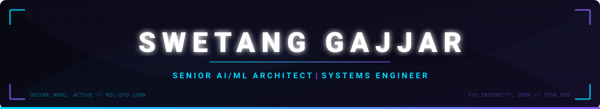

<div align="center">



<br/>


<br/>

[](https://swetang-portfolio.vercel.app)
[](https://www.linkedin.com/in/gajjarswetang/)
[](mailto:gajjarswetang@gmail.com)
[](https://github.com/SGajjar24)

<br/><br/>


</div>


## :rocket: Executive Summary

**Production AI systems for regulated and high-stakes domains.** Over 12 years of hands-on expertise spanning military-grade industrial systems automation (MIL-STD compliance), zero-hallucination legal forensic document intelligence, and high-performance LLM training/evaluation (RLHF).

---

## 🔬 Current Engineering Focus
*   **Forensic RAG**: Fusing long-context reasoning with zero-hallucination parent-document grounding for multi-decade land deeds and court files ([Repo](https://github.com/SGajjar24/Courtroom-AI-Citation-Engine) | [Architecture](https://github.com/SGajjar24/Courtroom-AI-Citation-Engine#system-architecture)).
*   **Defense AI**: Designing robust, ITAR-compliant identification and high-speed motion-control software (Lockheed Martin, Raytheon programs).
*   **LLM Evaluation & RLHF**: Optimizing inference latency, model alignment, and prompt validation workflows (Scale AI engagements).

---

## 💻 Tech Stack & Professional Reality Check

```python
class SwetangGajjar(SeniorAIArchitect, SystemsEngineer):
    def __init__(self):
        self.location = "India | USA | Remote"
        self.education = "M.S. Computer Engineering | CSU Fullerton"
        
        # Absolute Core Mastery (12+ Years Production Work)
        self.expert_domain = {
            "Languages": ["Python", "C++", "C#", "SQL"],
            "AI_Infrastructure": ["Agentic Workflows", "Vector DBs (FAISS)", "LangChain", "Advanced RAG"],
            "Systems_Engineering": ["Bilingual Neural OCR", "MIL-STD-130N", "Galil 4-Axis Controllers", "Computer Vision"]
        }
        
        # Professional UI Competencies (Used for Telemetry & System Dashboards)
        self.proficient_domain = {
            "Frontend_Stack": ["TypeScript", "React 19", "Next.js 15", "Tailwind CSS v4"],
            "DevOps_&_Cloud": ["Docker", "AWS IoT Core", "Vercel", "GitHub Actions"]
        }
```

## 🛠️ Click to Expand Full Graphical Stack Matrix
<div align="center">

[](https://github.com/SGajjar24)

</div>


## 🥇 Featured Systems

| System / Project & Domain | Key Technology Stack | Quantitative Impact & Production Signal |
| :--- | :--- | :--- |
| **[Courtroom AI Citation Engine](https://github.com/SGajjar24/Courtroom-AI-Citation-Engine)**<br/>`Legal Forensic AI`<br/>  | `Python` `LangChain`<br/>`FAISS` `Legal NLP` | **95%+ retrieval grounding** accuracy for court filing compliance. |
| **[Agentic Document Forensics](https://github.com/SGajjar24/Agentic-Document-Forensics)**<br/>`Multi-Agent RAG`<br/>  | `Gemini Pro`<br/>`NotebookLM` `MCP` | Automated timeline reconstruction across **20+ years of fragmented records**. |
| **[Multilingual OCR Pipeline](https://github.com/SGajjar24/Multilingual-OCR-Pipeline)**<br/>`Computer Vision`<br/>  | `TensorFlow` `OpenCV`<br/>`BiLSTM` | Neural Gujarati-English segmentation with **99.9% QA precision**. |
| **[Aether AI System Tuner](https://github.com/SGajjar24/aether-ai-tuner)**<br/>`LLMOps Profiling`<br/>  | `React 19` `TypeScript`<br/>`Node.js` | Real-time performance dashboard for **latency optimization**. |
| **[Folder Intelligence CLI](https://github.com/SGajjar24/folder-intelligence)**<br/>`Systems Audit`<br/>  | `Python` `CLI`<br/>`Local OCR` | Automated offline structuring and indexing of major file hubs. |
| **[THIRD-EYE (Gemini Winner)](https://github.com/SGajjar24/THIRD-EYE)**<br/>`Media Authentication`<br/>  | `Python` `Gemini Vision`<br/>`FAISS` | Real-time authenticity verification with **vector identity mapping**. |

<br/>

### 🏛️ Flagship Architecture Spotlight: Agentic RAG
*Below is the structural design showcasing the duality of high-reliability physical systems automation, vector embedding pipelines, and semantic RAG coordination:*

<div align="center">
  
</div>

---

## 🛡️ Key Enterprise & Defense Client Footprint
*Over 12 years building mission-critical marking, perspective vision, and industrial motion controllers for defense-sensitive programs:*

<div align="center">


</div>


## :briefcase: Professional Chronology
* **2024 - Present**: **Senior AI/ML Architect & Consultant** — Independent RAG, legal forensic engines, neural OCR pipelines.
* **2024 - 2025**: **AI Engineer (Contract @ Scale AI)** — Fine-tuned models, RLHF, alignment benchmarks, optimized inference latency by **30%**.
* **2017 - 2022**: **Senior Software Engineer (Jetec Corp)** — Managed team of 5, engineered **MIL-STD-130N / ITAR-compliant** tracking systems.
* **2013 - 2017**: **MS Computer Engineering** — California State University, Fullerton.

---

## 📈 GitHub Live Contribution Telemetry

<div align="center">

### 🐍 Contribution Grid Arcade

<picture>
  <source media="(prefers-color-scheme: dark)" srcset="https://raw.githubusercontent.com/SGajjar24/SGajjar24/output/github-contribution-grid-snake-dark.svg?v=1.3" />
  <source media="(prefers-color-scheme: light)" srcset="https://raw.githubusercontent.com/SGajjar24/SGajjar24/output/github-contribution-grid-snake.svg?v=1.3" />
  
</picture>

<br/>

> 💡 **Developer Note**: Enterprise repositories representing private defense and consulting engagements (over 12+ years) are hidden under NDAs. To view the anonymized contribution telemetry, enable *"Show private contributions on my profile"* in your personal GitHub Settings.

<br/>


*"Bridging military-grade reliability with advanced agentic intelligence — one commit at a time."*

</div>
